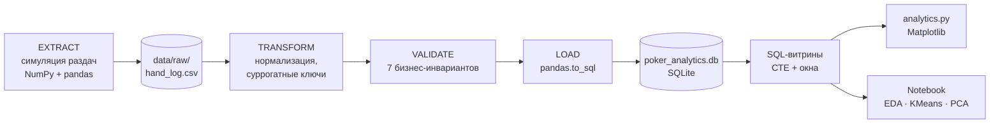
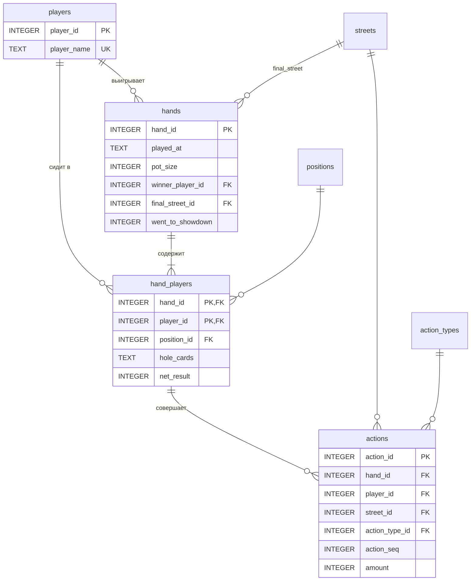
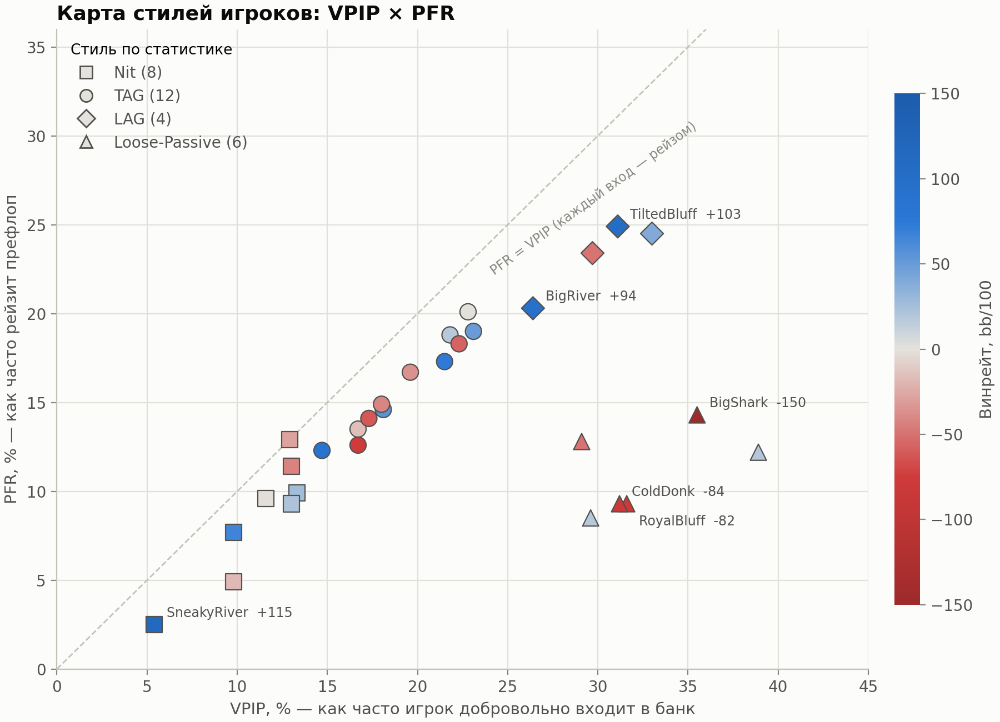
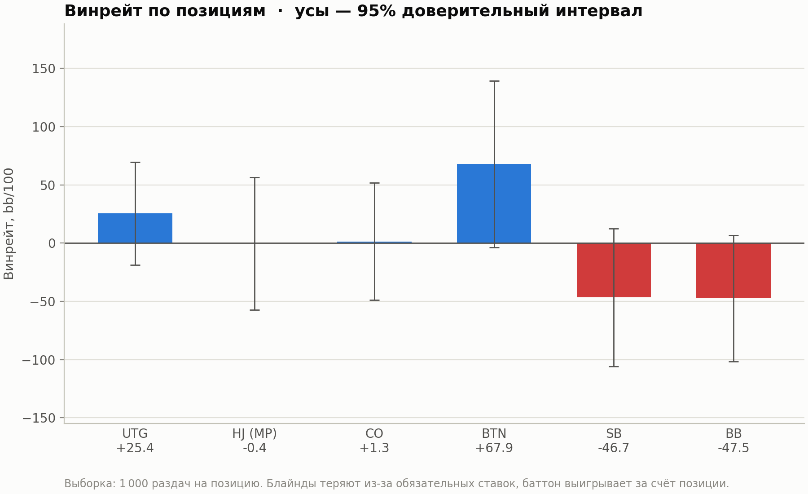
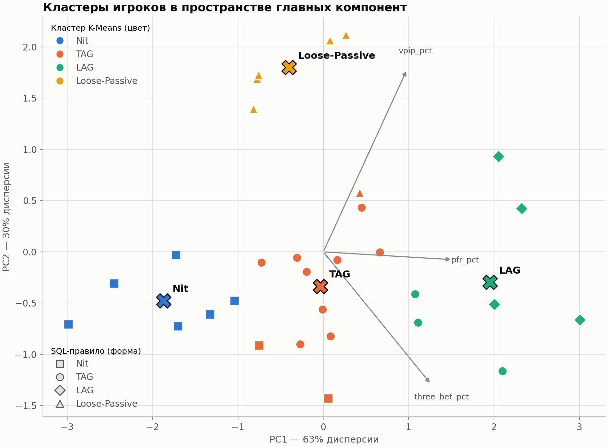
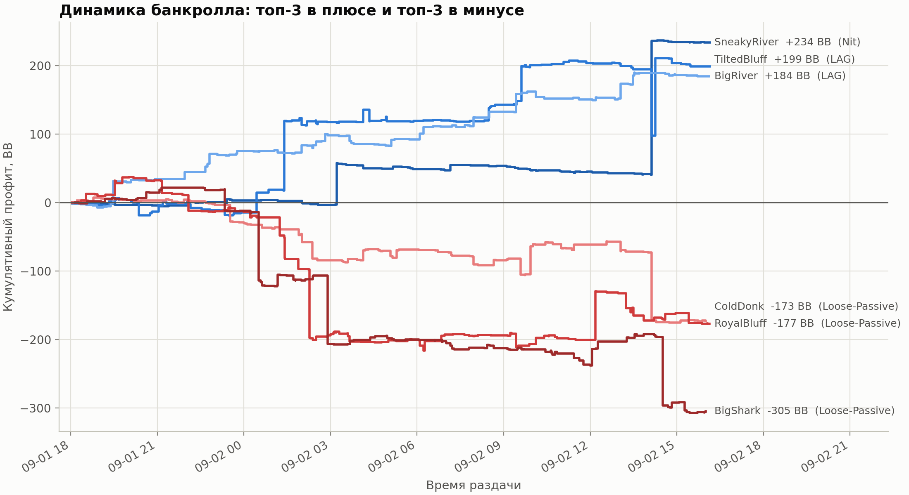
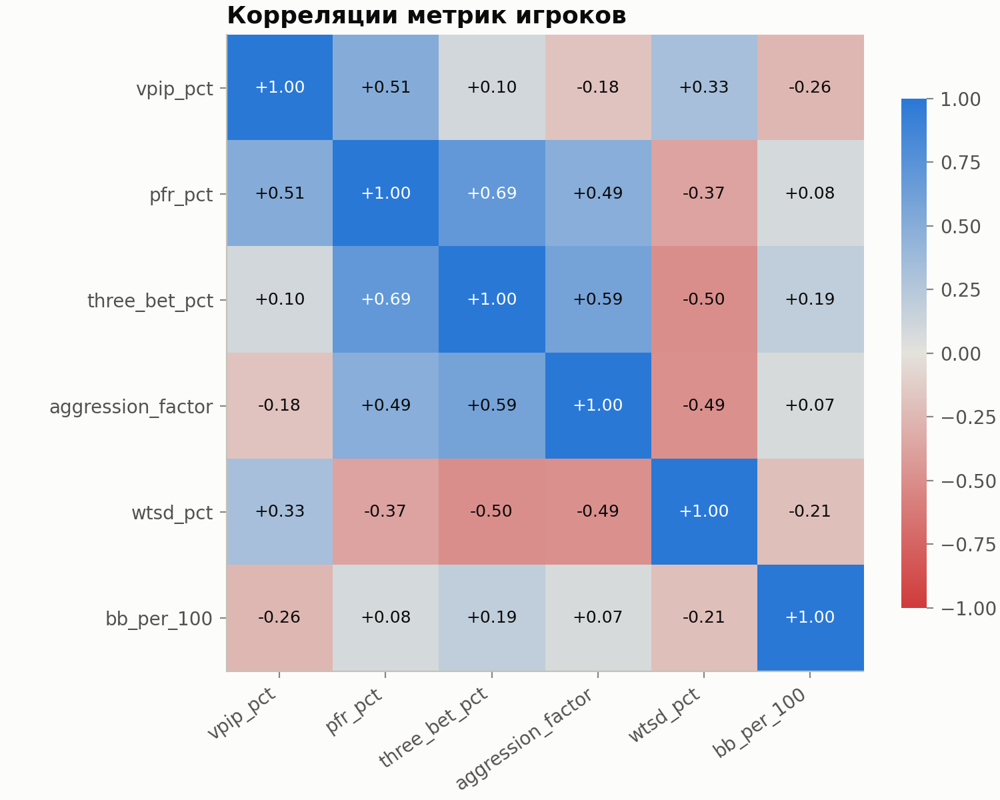
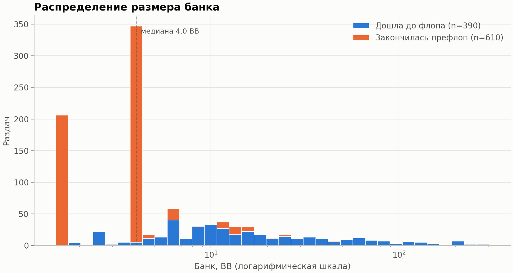
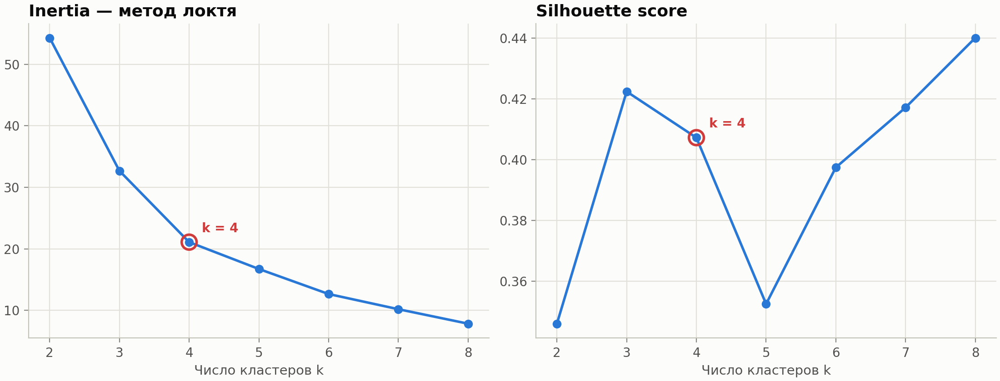

# ♠️ Texas Hold'em ETL & Analytics Pipeline


End-to-end пайплайн для анализа раздач No-Limit Texas Hold'em (6-max): генерация логически связного
лога → нормализация → валидация → загрузка в SQLite → SQL-витрины → визуализация → ML-кластеризация игроков.

> Проект демонстрирует навыки **Data Analyst / Data Engineer**: проектирование нормализованной схемы,
> ETL на pandas/NumPy, контроль качества данных, аналитический SQL (CTE, оконные функции),
> визуализацию и машинное обучение без учителя с честной проверкой по ground truth.

### Ключевые результаты

| | |
|---|---|
| **Данные** | 1 000 раздач · 30 игроков · 10 206 действий · 7/7 проверок качества |
| **SQL-витрина** | VPIP, PFR, 3-bet %, AF, WTSD, bb/100 для каждого игрока и позиции |
| **Правило в SQL** | стиль игрока распознан у 26 из 30 (87%) |
| **K-Means без учителя** | те же 87% совпадения со скрытыми профилями (ARI 0.62, NMI 0.69) |
| **PCA** | 2 компоненты сохраняют 94% дисперсии признаков |

---

## 📌 Содержание
- [Архитектура пайплайна](#-архитектура-пайплайна)
- [Схема базы данных](#-схема-базы-данных)
- [Модель генерации данных](#-модель-генерации-данных)
- [Быстрый старт](#-быстрый-старт)
- [Структура репозитория](#-структура-репозитория)
- [Контроль качества данных](#-контроль-качества-данных)
- [SQL-аналитика](#-sql-аналитика)
- [ML: кластеризация игроков](#-ml-кластеризация-игроков)
- [Ограничения](#-ограничения)
- [Roadmap](#-roadmap)

---

## 🏗 Архитектура пайплайна



| Этап | Файл | Что делает |
|---|---|---|
| 1. ETL | `src/data_loader.py`, `sql/database_setup.sql` | генерирует, нормализует, валидирует и загружает данные |
| 2. Аналитика | `sql/analytics_queries.sql`, `src/analytics.py` | витрины метрик, графики, доверительные интервалы |
| 3. ML и EDA | `notebooks/eda_and_clustering.ipynb` | корреляции, кластеризация, PCA, динамика банкролла |

## 🗄 Схема базы данных



Ключевые решения:
- **STRICT-таблицы** — SQLite отклоняет значения неверного типа.
- **Суммы в фишках (INTEGER)**, а не REAL — никаких ошибок округления.
- **Справочники** `positions`, `streets`, `action_types` с флагами `is_voluntary` / `is_aggressive` — метрики VPIP, PFR, AF считаются одним `JOIN`.
- **Составной FK** `actions(hand_id, player_id) → hand_players` — действовать может только игрок, сидящий в раздаче.
- **Триггер** запрещает `fold`/`check` с ненулевой суммой и `call`/`bet` без суммы.

## 🎲 Модель генерации данных

| Компонент | Реализация |
|---|---|
| Игроки | 30 игроков 4 архетипов: **Nit, TAG, LAG, Fish** со скрытыми параметрами стиля |
| Раздача карт | Векторная перетасовка колоды для всех раздач сразу (`argsort` случайной матрицы) |
| Сила руки | Формула Чена → перцентиль среди всех 1326 комбинаций |
| Префлоп | Диапазоны по позициям (UTG ⟶ BTN), опен 2.5 BB, 3-бет x3/x4, 4-бет x2.3, лимпы |
| Постфлоп | Вэлью-ставки, блефы, рейзы, коллы по шансам банка (pot odds) |
| Шоудаун | Побеждает лучшая «сила руки» на ривере |

Скрытые параметры игроков сохраняются в `data/raw/player_profiles.csv` — это **ground truth**:
по нему проверяется, восстанавливают ли SQL-правило и K-Means настоящий стиль игры.

## 🚀 Быстрый старт

```bash
git clone https://github.com/Andron1dze/texas-holdem-etl.git
cd texas-holdem-etl
python -m venv .venv && source .venv/bin/activate      # Windows: .venv\Scripts\activate
pip install -r requirements.txt

python src/data_loader.py          # 1. ETL: 1000 раздач (seed=42) → data/poker_analytics.db
python src/analytics.py            # 2. SQL-витрины + графики → reports/
jupyter lab notebooks/eda_and_clustering.ipynb   # 3. EDA и ML
```

Параметры генерации: `python src/data_loader.py --hands 50000 --players 80 --seed 7`.
Все результаты воспроизводимы: одинаковый `seed` даёт побайтно одинаковые данные.

## 📁 Структура репозитория

```
texas-holdem-etl/
├── README.md
├── requirements.txt
├── .gitignore
├── sql/
│   ├── database_setup.sql          # DDL: таблицы, справочники, триггер, индексы, view
│   └── analytics_queries.sql       # витрины: v_player_stats, v_position_winrate
├── src/
│   ├── data_loader.py              # ETL: generate → transform → validate → load
│   └── analytics.py                # SQL → pandas → Matplotlib, сверка с ground truth
├── notebooks/
│   ├── eda_and_clustering.ipynb    # EDA, K-Means, PCA, банкролл (с выводами)
│   └── eda_and_clustering.py       # тот же ноутбук в формате `# %%` — для чистых diff
├── data/
│   ├── raw/                        # сырой слой: hand_log.csv, player_profiles.csv
│   └── poker_analytics.db          # генерируется, в .gitignore
├── reports/
│   ├── player_stats.csv            # выгрузка витрины игроков
│   └── figures/                    # все графики проекта
└── tests/                          # (план) pytest на инварианты
```

## ✅ Контроль качества данных

| Уровень | Проверки |
|---|---|
| Python (до загрузки) | zero-sum по каждой раздаче · банк = сумма ставок · 6 игроков за столом · победитель сидит в раздаче · никто не проигрывает больше стека · сумма соответствует типу действия · уникальность порядка действий |
| SQLite (при загрузке) | STRICT-типы · PK / FK / UNIQUE / CHECK · триггер на суммы |
| SQLite (после загрузки) | `PRAGMA foreign_key_check` · `PRAGMA integrity_check` · сверка количества строк |

## 📊 SQL-аналитика

Аналитический слой — три уровня представлений в `sql/analytics_queries.sql`:

| Представление | Что содержит |
|---|---|
| `v_preflop_action_context` | каждое префлоп-действие + `raises_before` (оконная функция `SUM() OVER`) |
| `v_hand_player_facts` | факты «игрок в раздаче»: флаги VPIP/PFR/3-bet, постфлоп-агрессия, профит в BB |
| `v_player_stats` | **витрина игроков**: VPIP, PFR, 3-bet %, AF, WTSD, bb/100, стиль, ранг |
| `v_position_winrate` | **витрина позиций**: bb/100, VPIP, PFR + моменты для доверительного интервала |





- Loose-Passive игроки (много коллов, мало рейзов) — главные доноры пула: 4 из 6 в минусе, включая худший результат (−150 bb/100).
- Баттон — самая прибыльная позиция, блайнды проигрывают ~47 bb/100 из-за обязательных ставок и игры без позиции.

## 🤖 ML: кластеризация игроков

Ноутбук [`notebooks/eda_and_clustering.ipynb`](notebooks/eda_and_clustering.ipynb) отвечает на вопрос:
**может ли алгоритм без учителя сам найти 4 типажа игроков, заложенных в генератор?**

**Подход:** признаки `vpip_pct`, `pfr_pct`, `three_bet_pct` → `StandardScaler` → `KMeans(k=4, n_init=50)`.
Число кластеров проверено методом локтя и silhouette. Номера кластеров сопоставлены со стилями
венгерским алгоритмом (`scipy.optimize.linear_sum_assignment`).

| Сравнение | Accuracy | ARI | NMI |
|---|---|---|---|
| K-Means vs ground truth | 0.87 | 0.62 | 0.69 |
| SQL-правило vs ground truth | 0.87 | 0.66 | 0.78 |
| K-Means vs SQL-правило | 0.80 | 0.49 | 0.65 |

K-Means без экспертных порогов достиг той же точности, что и правило, написанное вручную.
Все 4 ошибки — на границах соседних типажей, где шумит 3-bet % (60–100 возможностей на игрока).



PC1 (63% дисперсии) — «общая агрессия», PC2 (30%) — ось «лузово-пассивности», по которой
Fish уходят далеко от регуляров.



Кумулятивный профит считается в SQL оконной функцией `SUM() OVER (PARTITION BY player ORDER BY time)`.
Все три худших игрока — Loose-Passive; кривые растут ступенями — итог часто решают 1–2 крупных банка.

<details>
<summary>Разведочный анализ: корреляции и распределение банков</summary>






</details>

## ⚠️ Ограничения

- **Данные синтетические.** Постфлоп-сила руки моделируется случайным блужданием, а не оценкой
  реальной комбинации; сплит-поты, рейк и разные стеки не моделируются.
- **Маленькая выборка.** 1000 раздач ≈ 200 на игрока: 95% ДИ винрейта по позиции ±45–70 bb/100,
  3-bet % у отдельных игроков шумный. Для устойчивых выводов — `--hands 50000`.
- **Silhouette почти одинаков для k = 3 и k = 4** — выбор k = 4 опирается на предметную область.

## 🗺 Roadmap
- [x] Этап 1 — схема БД и ETL-загрузчик
- [x] Этап 2 — SQL-витрины (VPIP, PFR, 3-bet %, AF, WTSD, bb/100) и визуализация
- [x] Этап 3 — EDA, кластеризация K-Means, PCA, динамика банкролла
- [ ] Тесты (pytest) на инварианты данных и CI (GitHub Actions)
- [ ] Постфлоп-признаки (AF, WTSD) и сравнение K-Means с GaussianMixture

## 👤 Автор
**Andron1dze** — [GitHub](https://github.com/Andron1dze)
