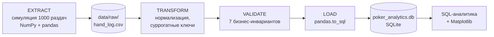
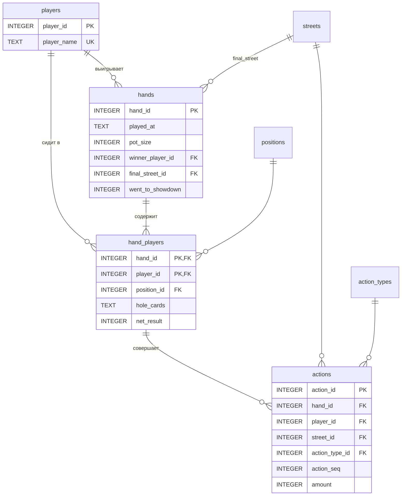

# ♠️ Texas Hold'em ETL & Analytics Pipeline


Мини-ETL пайплайн для анализа раздач No-Limit Texas Hold'em (6-max):
генерация логически связного лога → нормализация → валидация → загрузка в SQLite → SQL-аналитика и визуализация.

> Проект демонстрирует навыки **Data Analyst / Data Engineer**: проектирование нормализованной схемы,
> ETL на pandas/NumPy, контроль качества данных, аналитические SQL-запросы.

---

## 📌 Содержание
- [Архитектура пайплайна](#-архитектура-пайплайна)
- [Схема базы данных](#-схема-базы-данных)
- [Модель генерации данных](#-модель-генерации-данных)
- [Быстрый старт](#-быстрый-старт)
- [Структура репозитория](#-структура-репозитория)
- [Контроль качества данных](#-контроль-качества-данных)
- [Аналитика и результаты](#-аналитика-и-результаты)
- [Roadmap](#-roadmap)

---

## 🏗 Архитектура пайплайна



## 🗄 Схема базы данных



Ключевые решения:
- **STRICT-таблицы** — SQLite отклоняет значения неверного типа.
- **Суммы в фишках (INTEGER)**, а не REAL — никаких ошибок округления.
- **Справочники** `positions`, `streets`, `action_types` с флагами `is_voluntary` / `is_aggressive` — метрики VPIP, PFR, AF считаются одним `JOIN`.
- **Составной FK** `actions(hand_id, player_id) → hand_players` — действовать может только игрок, сидящий в раздаче.
- **Триггер** запрещает `fold`/`check` с ненулевой суммой и `call`/`bet` без суммы.

## 🎲 Модель генерации данных

| Компонент | Реализация |
|---|---|
| Игроки | 30 игроков 4 архетипов: **Nit, TAG, LAG, Fish** со скрытыми параметрами стиля |
| Раздача карт | Векторная перетасовка колоды для всех раздач сразу (`argsort` случайной матрицы) |
| Сила руки | Формула Чена → перцентиль среди всех 1326 комбинаций |
| Префлоп | Диапазоны по позициям (UTG ⟶ BTN), опен 2.5 BB, 3-бет x3/x4, 4-бет x2.3, лимпы |
| Постфлоп | Вэлью-ставки, блефы, рейзы, коллы по шансам банка (pot odds) |
| Шоудаун | Побеждает лучшая «сила руки» на ривере |

Скрытые параметры игроков сохраняются в `data/raw/player_profiles.csv` — это ground truth,
по которому можно проверить, восстанавливает ли аналитика стиль игры (VPIP / PFR / AF).

## 🚀 Быстрый старт

```bash
git clone https://github.com/Andron1dze/texas-holdem-etl.git
cd texas-holdem-etl
python -m venv .venv && source .venv/bin/activate
pip install -r requirements.txt

python src/data_loader.py                    # 1000 раздач, seed=42
python src/data_loader.py --hands 5000 --seed 7
python src/analytics.py                      # витрины + графики в reports/
```

Пример лога запуска:
```
Extract: 1000 hands, ~10k actions, 30 players
Validate: 7/7 checks passed
Load: players 30 | hands 1000 | hand_players 6000 | actions ~10k
Verify: row counts match, FK and integrity checks passed
```

## 📁 Структура репозитория

```
texas-holdem-etl/
├── README.md
├── requirements.txt
├── .gitignore
├── sql/
│   ├── database_setup.sql      # DDL: таблицы, справочники, триггер, индексы, view
│   └── analytics_queries.sql   # витрины: v_player_stats, v_position_winrate
├── src/
│   ├── data_loader.py          # ETL: generate → transform → validate → load
│   └── analytics.py            # SQL → pandas → Matplotlib, сверка с ground truth
├── data/
│   ├── raw/                    # сырой слой: hand_log.csv, player_profiles.csv
│   └── poker_analytics.db      # генерируется, в .gitignore
├── notebooks/                  # (этап 3) EDA и отчёт
├── reports/
│   ├── player_stats.csv        # выгрузка витрины игроков
│   └── figures/                # графики для README
└── tests/                      # (этап 4) pytest на инварианты
```

## ✅ Контроль качества данных

| Уровень | Проверки |
|---|---|
| Python (до загрузки) | zero-sum по каждой раздаче · банк = сумма ставок · 6 игроков за столом · победитель сидит в раздаче · никто не проигрывает больше стека · сумма соответствует типу действия · уникальность порядка действий |
| SQLite (при загрузке) | STRICT-типы · PK / FK / UNIQUE / CHECK · триггер на суммы |
| SQLite (после загрузки) | `PRAGMA foreign_key_check` · `PRAGMA integrity_check` · сверка количества строк |

## 📊 Аналитика и результаты

Аналитический слой — три уровня SQL-представлений в `sql/analytics_queries.sql`:

| Представление | Что содержит |
|---|---|
| `v_preflop_action_context` | каждое префлоп-действие + `raises_before` (оконная функция `SUM() OVER`) |
| `v_hand_player_facts` | факты «игрок в раздаче»: флаги VPIP/PFR/3-bet, постфлоп-агрессия, профит в BB |
| `v_player_stats` | **витрина игроков**: VPIP, PFR, 3-bet %, AF, WTSD, bb/100, стиль, ранг |
| `v_position_winrate` | **витрина позиций**: bb/100, VPIP, PFR + моменты для доверительного интервала |

**Проверка на ground truth.** Стиль, определённый по статистике, совпал со скрытым
архетипом генератора у **26 из 30 игроков (87%)**: все Fish и Nit распознаны верно,
расхождения — на границе TAG/LAG (VPIP 22–23%).


Выводы:
- Loose-Passive игроки (много коллов, мало рейзов) — главные доноры пула: 4 из 6 в минусе, включая худший результат (−150 bb/100).
- Баттон — самая прибыльная позиция, блайнды проигрывают ~47 bb/100 из-за обязательных ставок и игры без позиции.
- 1000 раздач — маленькая выборка для винрейта: 95% ДИ по позиции ±45–70 bb/100. Стабильные выводы о
  конкретных игроках требуют десятков тысяч раздач (`--hands 50000`).

## 🗺 Roadmap
- [x] Этап 1 — схема БД и ETL-загрузчик
- [x] Этап 2 — SQL-витрины (VPIP, PFR, 3-bet %, AF, WTSD, bb/100) и визуализация
- [ ] Этап 3 — EDA-ноутбук: распределение банков, динамика банкролла, кластеризация стилей
- [ ] Этап 4 — тесты (pytest) и CI (GitHub Actions)

## 👤 Автор
**Andron1dze** — [GitHub](https://github.com/Andron1dze)
